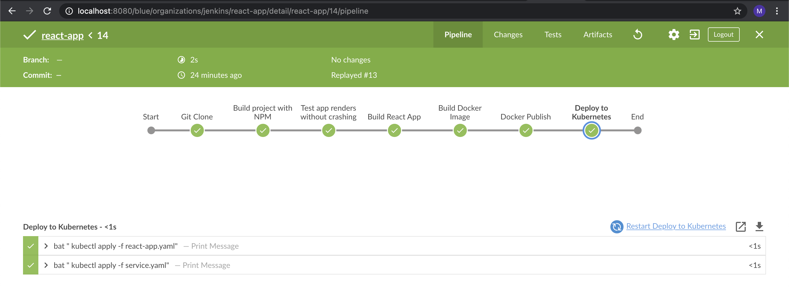

## Jenkins Pipeline

## Tecnologías CI:

1. **React**: es una biblioteca Javascript de código abierto diseñada para crear interfaces de usuario con el objetivo de facilitar el desarrollo de aplicaciones en una sola página.

2. **Jest**: herramienta para escribir tests unitarios para react.

3. **Enzyme**: herramienta para escribir test de integración para react.

4. **NPM**: es el sistema de gestión de paquetes por defecto para Node.js, un entorno de ejecución para JavaScript.

4. **GitHub**: repositorio Git que aloja la app react.
